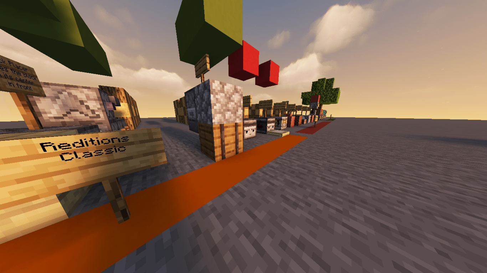
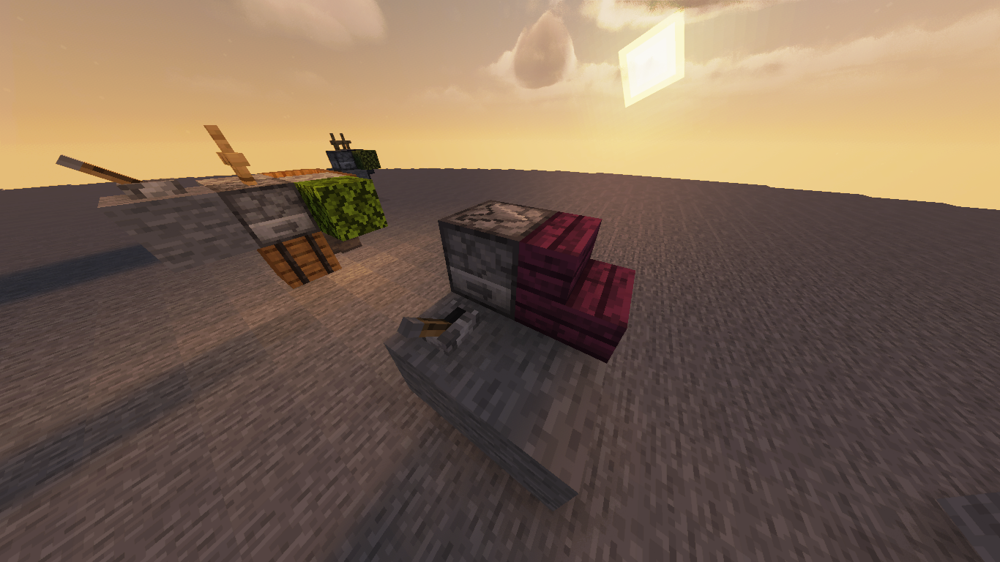
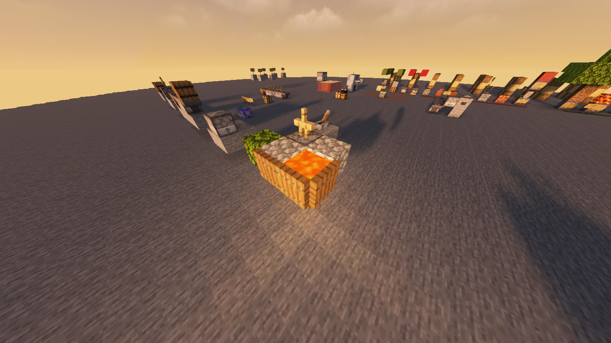
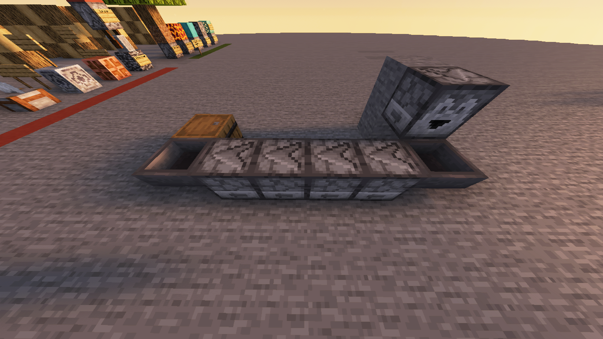
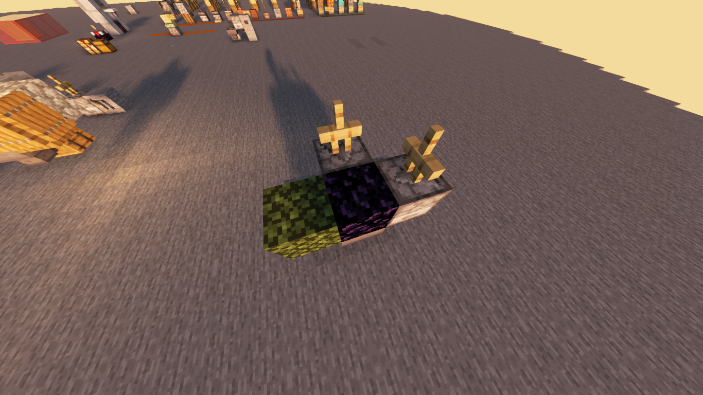

# ⚡ Redstone Additions - Automate Minecraft! ⚡

Welcome to the ultimate redstone enhancement datapack for Minecraft 1.21.4! Get ready to revolutionize your redstone builds with powerful new components and mechanics.

Transform your redstone contraptions from simple circuits into incredible automated machinery. Whether you're a technical player or just getting started with redstone, this datapack opens up exciting new possibilities! 

## ✨ Quick Preview
Take a look at what awaits you:

## 🔧 Amazing New Components

🏗️ Block Placer

⚒️ Block Breaker

➡️ Conveyor

🌋 Lava Reactor

# Details
A Minecraft datapack that enhances redstone functionality for version 1.21.4.  

## Read the docs !

## Features
- Enhanced redstone mechanics
- New redstone components
- Performance optimizations

## Downoalds

## Installation
1. Download the latest release
2. Place the datapack in your world's `datapacks` folder
3. Reload your world